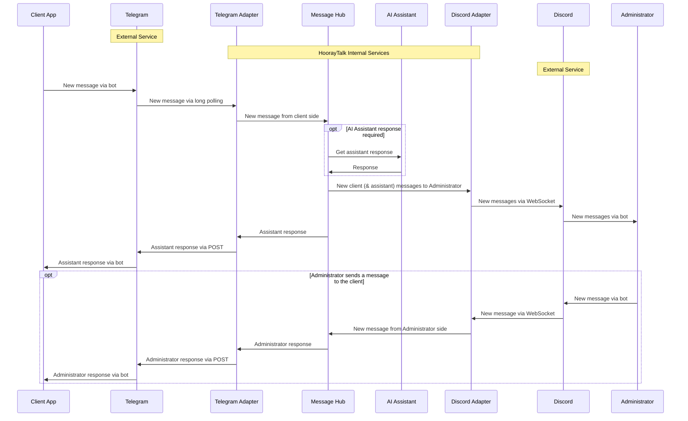

# HoorayTalk

## Welcome to the HoorayTalk Project!

Dear reviewer, thank you for taking the time to check out this project. We have embraced the philosophy that "done is better than perfect," which inspired us to release this pre-release version earlier than usual, even before everything was finalized according to standard development protocols. Therefore, before you delve into the code, we highly recommend reading through this README to fully understand the current scope and developmental context of this project. This will give you a clearer picture of what has been implemented so far and what is planned for future updates.

## Project Description

HoorayTalk is a multi-tenant system designed to support a diverse range of businesses through a unique live chat interface with AI assistance. Each tenant, or business, operates within its own dedicated Discord server, providing a tailored space for client interactions. This space serves as the administrative layer where each business can engage directly with customers.

The core functionality of HoorayTalk revolves around an integrated Telegram bot assigned to each tenant. This bot acts as the first point of contact for new clients, employing AI to follow business-specific instructions provided in natural language. These instructions might include tasks such as taking orders, gathering information, or responding to customer inquiries, which the bot executes accordingly.

### How It Works

When a client initiates a conversation, the bot, following the set instructions, begins interacting intelligently within seconds. For example, if the business involves delivery services, the bot collects all necessary details from the client. Once the order is confirmed by the client, the bot steps back, allowing a human operator to take over to finalize or further clarify the details.

This system significantly reduces response times and keeps the client engaged, even if the operator is not immediately available to respond. Each new chat initiated by a client in Telegram is mirrored in a new channel on Discord, where multiple authorized personnel can interact with the client if needed. As soon as an operator joins the conversation, the AI automatically disengages, handing over control to the human representative.

This innovative approach not only saves time but also enhances customer retention by swiftly addressing their needs, capturing their attention, and reducing the likelihood of them turning to competing businesses.

## Technology Stack

HoorayTalk utilizes a robust stack of technologies to ensure scalable, secure, and efficient operations. Below is a breakdown of the key technologies and libraries used in the project:

- **Java**: The core programming language providing the backbone for the server-side logic.
- **Spring Framework**: A comprehensive programming and configuration model for modern Java-based enterprise applications.
  - **Spring Boot**: Simplifies the development of new Spring applications through convention over configuration.
  - **Spring MVC / Spring Web**: Framework for building web applications and services with an emphasis on more flexible and loosely coupled systems.
  - **Spring Security**: Currently used to secure communication between microservices, ensuring that interactions are authenticated and authorized.
  - **Spring WebFlux**: Supports building asynchronous, non-blocking applications using the reactive programming model.
  - **Spring Data JPA**: Simplifies the implementation of data access layers by reducing the amount of boilerplate code required.
  - **Spring Validation**: Ensures that data received through the APIs meets business rules before processing.
  - **Spring Boot Actuator**: Offers built-in endpoints for monitoring and interacting with the application.
- **Hibernate**: A powerful ORM framework that handles all the database communication and complex mappings between Java objects and database tables.
- **PostgreSQL**: The primary relational database to manage all data persistence and querying operations.
- **Liquibase**: Manages database schema changes through a version-controlled approach, ensuring smooth transitions and deployments.
- **Jasypt**: Utilized for encrypting tokens stored in the database to enhance security.
- **Telegram Bots**: Enables communication with users via Telegram, integral to the service's operation.
- **JDA (Java Discord API)**: Facilitates interaction with Discord servers, essential for managing tenant-specific spaces.
- **ModelMapper**: Used in the service's starter for dynamic typing and flexibility, enhancing the adaptability of microservices.
- **OpenAPI**: Facilitates the design and documentation of RESTful APIs with a Swagger-based interface for live interaction.
- **Nginx**: Planned to be implemented as a reverse proxy and load balancer to enhance scalability and performance. The architecture anticipates its integration to efficiently distribute client requests.

Each component of the stack was chosen for its performance, ease of integration, and ability to meet the complex demands of a multi-tenant live chat system. This robust architecture supports the rapid development and deployment of new features, while maintaining high standards of security and data integrity.

## Architecture Overview

## Current Limitations and Future Improvements

For detailed information on planned enhancements, please see the [Issues](https://github.com/avashchenkov/HoorayTalk/issues) section of this GitHub repository.

## Setup and Running

### Prerequisites

TODO: Add prerequisites for running the project.

### Running Locally

TODO: Add instructions on how to run the project locally.